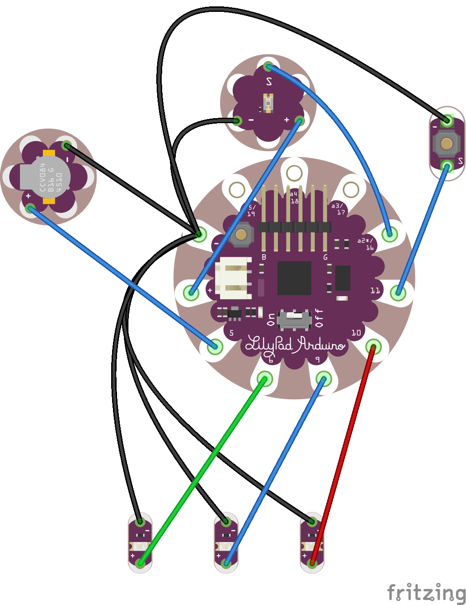
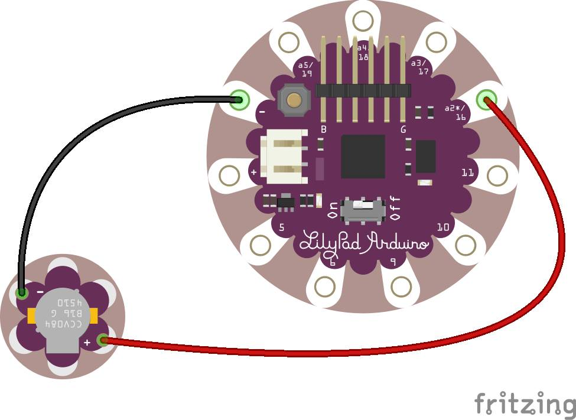
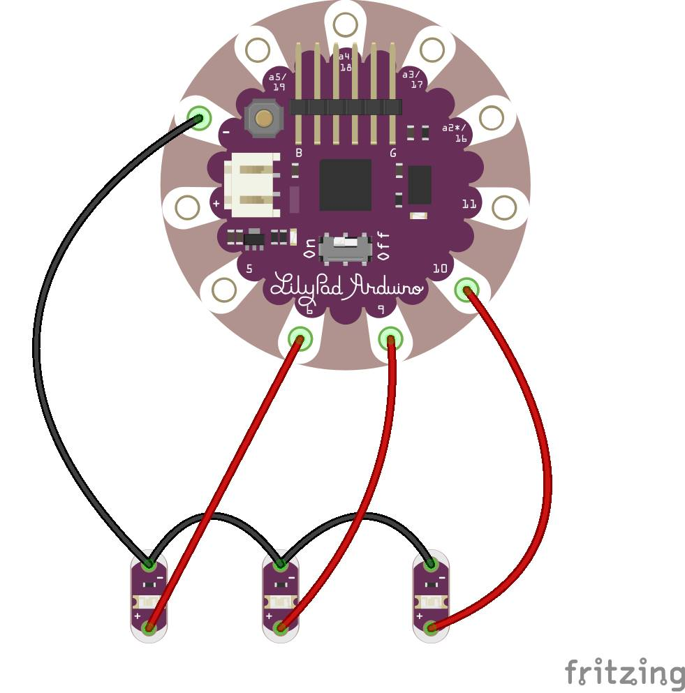
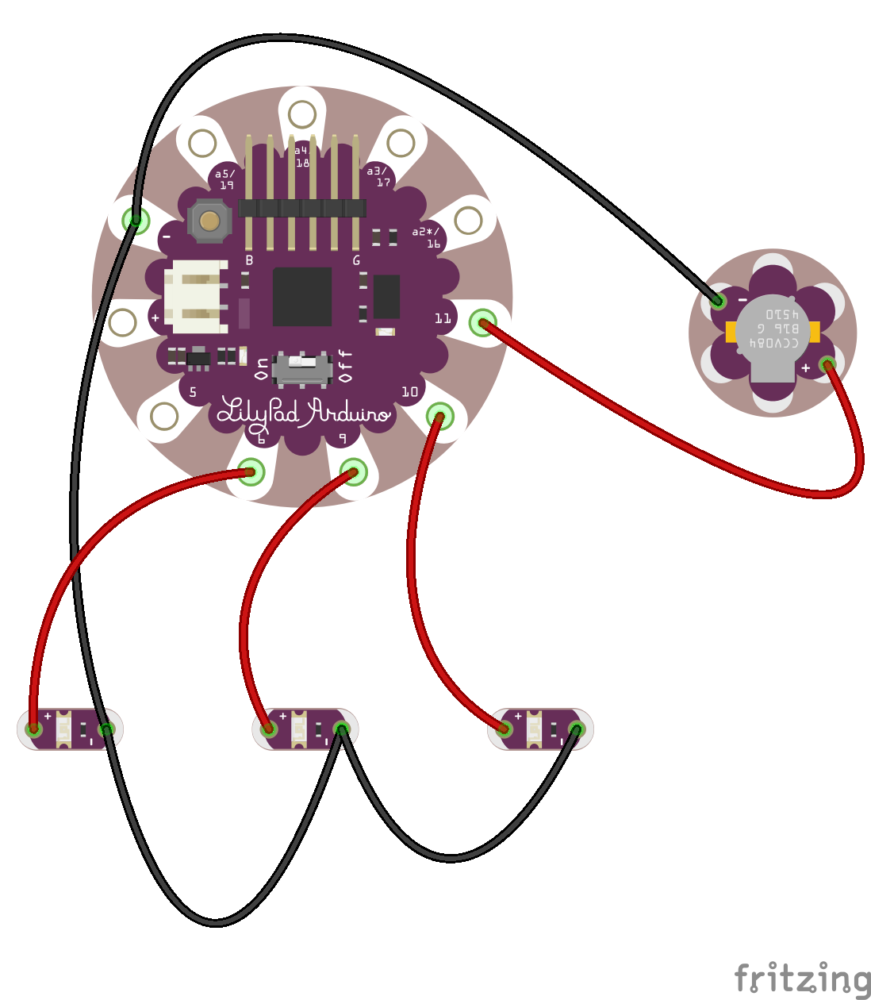
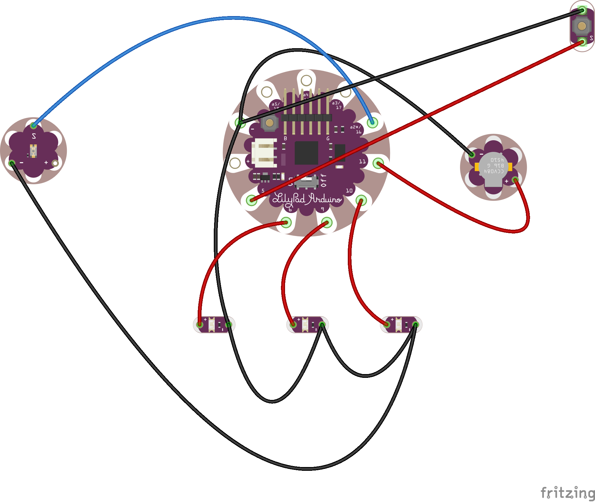
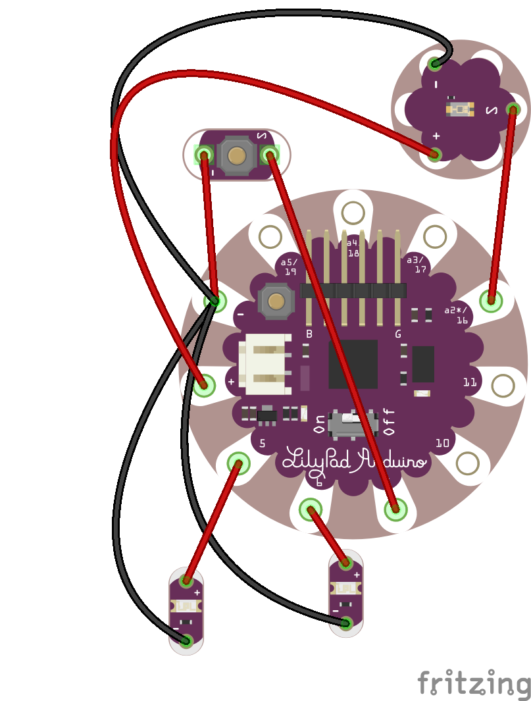
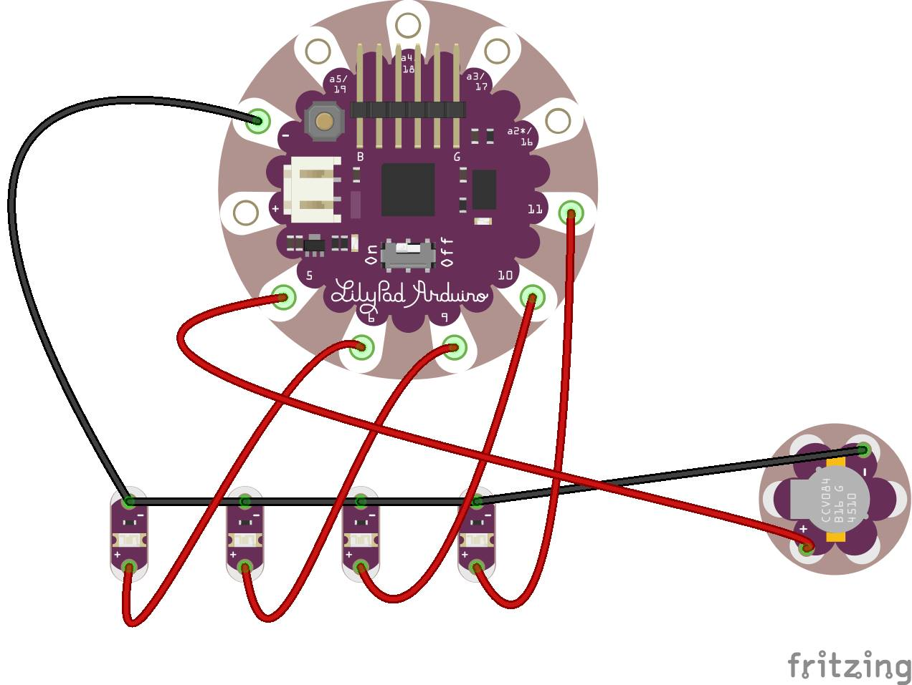

# Arduino Hurricane

Winter Term 2015 Arduino Projects

Alexander Miller & Thomas Ring

# Main Project (outdoor)
This program is for the light recording device. It is currently in development.
This program will perform the following using an arduino lillypad:
1. Read in whether or not a person is inside/outside.
2. Record how long said person is inside/outside.
3. Alert the user via sound and/or light sensors indicating how long a person has been outside.
- Three lights will display "safe", "mild", "Dangerous". These will display how damaging the sun is without sunscreen
- One buzzer to give a musical song played at 15, 30, 45, and 60 minutes intervals.

Fritzing:

# Smaller Projects
## star_wars
Play the main theme of Star Wars with the buzzer.

[YouTube Video](https://www.youtube.com/watch?v=LRQTWj4wA-Y&feature=youtu.be)

Fritzing:

## ghost_rider
Flash three LEDS back and forth in the style of the "Ghost Rider" car.

[YouTube Video](https://www.youtube.com/watch?v=rnAzOvHkX3g&feature=youtu.be)

Fritzing:

## ghost_rider_song
Similar to above, but play a tone at each end of the led array.

[YouTube Video](https://www.youtube.com/watch?v=LfpORAia9TE&feature=youtu.be)

Fritzing:

## ghost_rider_song_button
Similar to above, but adds the ability to pause using a button in the middle of the array of lights flashing.

[YouTube Video](https://www.youtube.com/watch?v=hTgXR9eU0hs&feature=youtu.be)

Fritzing:

## lights_button_and_led
Two LEDS are controlled by two input sources.

The first is controlled by a simple button and is toggled on when the button is held and off when it is not being pressed.

The second is controlled by a light sensor with a threshold fo the reading and lights up when it gets too dark.

[YouTube Video]()

Fritzing:

## song_and_led
Sequentially light four lights followed by a tune (star wars).

[YouTube Video](https://www.youtube.com/watch?v=C5iyWgtUBoo&feature=youtu.be)

Fritzing:

